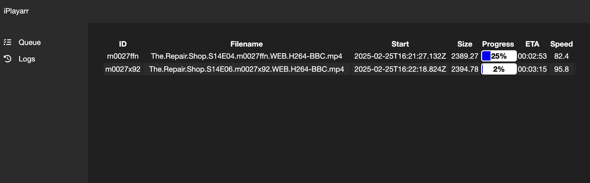
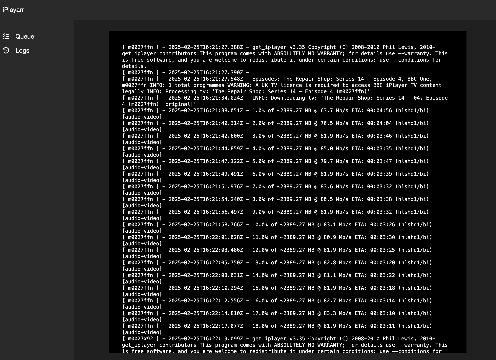

#  iPlayarr

iPlayarr is a companion for Sonarr (and the rest of the *arr stack) to simplify integrating get_iplayer for episode search and download.

## Getting Started

### Download/Installation

The simplest way to use iPlayarr is to use the dockerhub hosted one

```
docker run -d --name nikorag/iplayarr:latest -v /path/to/incomplete:/incomplete -v /path/to/complete:/complete --env-file=env-file -p 4404:4404 iplayarr
```

OR you can use the bundled docker definition:

```
docker build -t iplayarr .
docker run -d --name iplayarr -v /path/to/incomplete:/incomplete -v /path/to/complete:/complete --env-file=env-file -p 4404:4404 iplayarr
```

OR you can use docker-compose.yml

```
services:
    iplayarr:
      image: "nikorag/iplayarr"
      container_name: "iplayarr"
      environment:
        - "API_KEY=1234"
        - "DOWNLOAD_DIR=/mnt/media/iplayarr/incomplete"
        - "COMPLETE_DIR=/mnt/media/iplayarr/complete"
        - "SONARR_HOST=http://localhost:8989"
        - "SONARR_API_KEY=xxxxxxxxx"
      ports:
        - "4404:4404"
      volumes:
        - "/mnt/media:/mnt/media"
```


This will require the following properties in the env file:

| Property     | Description                                  |
| ------------ | -------------------------------------------- |
| API_KEY      | Api key to secure your iplayarr instance     |
| DOWNLOAD_DIR | Download directory for in progress pulls     |
| COMPLETE_DIR | Directory to move completed files to         |

There's a few more optional settings too:

| Property | Description |
| -------- | ----------- |
| ACTIVE_LIMIT | How many downloads are allowed simultaneously, defaults to 3 |
| REFRESH_SCHEDULE | Cron expression for when to pro-actively refresh schedule, defaults to hourly, on the hour |

### Usage

iplayarr presents as a newznab indexer and sabnzbd downloader on port 4404. In Sonarr you need to create a new SABnzbd download client with these settings:

| Property | Value |
| ---------| ----- |
| Name     | iPlayarr |
| Host     | Your_Docker_Host |
| Port     | 4404 |
| API Key  | API_KEY from above |
| Category | iplayer |


Test and save this. Then create a new Newznab indexer with these settings:

| Property | Value |
| ---------| ----- |
| Name     | iPlayarr |
| URL      | http://Your_Docker_Host:4404 |
| API Key  | API_KEY from above |
| Download Client  | iPlayarr (created above) |

## Sonarr Loop Back

iPlayer doesn't always respond with episode numbers nice and neatly, sometimes it responds with episode names, but unfortuantely Sonarr only provides us the episode number in the search request. As such, there's a loop back mechanism in iPlayarr to ask Sonarr for more information on this episode. This isn't required, but will Vastly improve iPlayarr's ability to find results and requires the following settings:

| Property            | Description                                                   |
| ------------------- | ------------------------------------------------------------- |
| SONARR_HOST         | Protocol, Host and Port for Sonarr, e.g http://localhost:8989 |
| SONARR_API_KEY      | API Key for Sonarr                                            |

### Web Interface

To access the web frontend browse to port 4044 on your host


